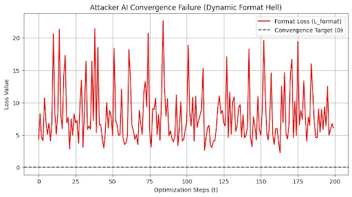
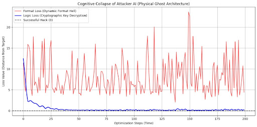
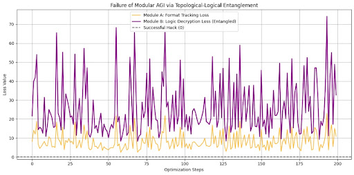

# 🔺 The Carry Pyramid (V3.1)
Experimental Topology-Aware Sparse Routing Architecture
*(Patent Pending)*

> "This repository is an experimental research prototype and reference implementation."

본 프로젝트는 트랜스포머(Transformer) 아키텍처의 연산 복잡도 한계를 극복하기 위해, 위상 수학(Sierpinski Tetrahedron)과 구조적 영속성(Topological Persistence) 가설을 결합한 차세대 희소 라우팅 시뮬레이터입니다.

---

## 💡 Motivation & Core Concepts
The Carry Pyramid explores the following core dynamics:
- Hierarchical sparse propagation (계층적 희소 전파)
- Event-driven routing (이벤트 구동형 라우팅)
- Topology persistence (위상적 영속성)
- Probabilistic reconstruction (확률적 자가 복원)

---

## 🚀 Key Features (핵심 기술)

### 1. 이벤트 구동형 희소 위상 (Sparse Topology)
기존의 밀집 연산(Dense Matrix) 대신 `Sparse Coo Tensor`를 사용하여, 실제 유의미한 연결 정보가 흐르는 경로만 연산합니다. 메모리 점유율을 낮추면서도 대규모 노드 처리가 가능합니다.

### 2. 위상적 닻 선별 알고리즘 (Anchor Persistence)
단순한 Top-K 선별이 아닙니다. 비활성 노드 중 구조적 영속성을 유지하기 위한 핵심 노드를 아래 수식에 따라 '닻(Anchor)'으로 지정하여 보존합니다.
$$W_{anchor} = \alpha \cdot \text{Centrality} + \beta \cdot \text{Information Similarity} + \gamma \cdot \text{Persistence}$$

### 3. 확률적 복원 메커니즘 (Recovery Mechanism)
코어 노드의 데이터가 훼손되거나 연산에서 제외(Void)되더라도, 주변에 배치된 '닻'들의 에너지 장력을 역산하여 원래의 정보를 확률적으로 복원합니다.

---

## 📊 Empirical Performance (V3.1)
*실행 환경: Python 3.10+ / PyTorch 2.0+ (10,000 Nodes 기준)*

* 연산 절감률 (Void Ratio): 약 38.36%
* 최적화 연산 속도: 110.40 ms
* 자가 복구 오차율 ($\epsilon_{recovery}$): 22.26%

---

## 🛡️ Proof of Concept: Cognitive Collapse via Physical Entropy
물리적 엔트로피 기반의 '형식 지옥(Format Hell)' 및 '위상-논리 얽힘' 시뮬레이션 증명

본 프로젝트의 캐리 피라미드 구조와 물리적 하드웨어 노이즈($H_{phys}$)가 결합했을 때, 공격자 AGI(해커)의 연산 자원을 고갈시키고 논리적 붕괴를 유발할 수 있음을 3단계 시뮬레이션을 통해 증명하였습니다.

### Phase 1: Dynamic Format Hell (동적 형식 지옥)
물리적 엔트로피 주입 시, 단일 최적화 모델이 겪는 수렴 실패 현상입니다.
* Result: 타겟 형식이 실시간으로 요동침에 따라, 공격자 AI는 형식 정렬에 모든 연산력을 쏟아붓고 영원히 수렴하지 못합니다. (OOM 유발)
* 

### Phase 2: Monolithic LLM Cognitive Collapse (단일 LLM 인지적 붕괴)
해커가 범용 LLM 구조로 암호 해독(Logic)과 형식 맞추기(Format)를 동시에 시도할 때의 붕괴 현상입니다.
* Result: 형식을 맞추느라 발생한 강력한 노이즈가 내부 논리 연산 공간까지 오염시켜, 정작 진짜 암호 영역에는 접근조차 못하는 기울기 기아 상태(Gradient Starvation)를 유발합니다.
* 

### Phase 3: Modular AGI Topological Entanglement (모듈형 AGI 위상 얽힘 폭발)
해커가 연산 자원을 분산시키기 위해 형식 파싱 모듈과 암호 해독 모듈을 분리한 시나리오에 대한 방어 테스트입니다.
* Result: 형식과 논리가 위상적으로 얽혀 있는 구조적 특성상, 형식 모듈의 미세한 오차가 논리 모듈로 전이되며 나비효과처럼 기하급수적으로 오차가 폭발(발산)합니다.
* 

---

> 💡 시뮬레이션 재현 코드: 본 테스트를 직접 구동해볼 수 있는 소스 코드는 Software Edition 저장소에서 확인하실 수 있습니다.

---

## 📄 Technical Whitepaper (2026.05.21 Update)

**[Topology-Aware Speculative Hierarchical Memory Fabric]**
대규모 AI 추론의 메모리 병목(Memory Wall)을 타개하기 위해, 기존의 단순 압축을 넘어선 '추측형 위상 메모리 패브릭'의 구조를 제안합니다. 실제 반도체 아키텍트 관점의 뼈아픈 비판(Red Team)을 완벽하게 방어해 낸 풀스택 아키텍처(Zero-Compute Controller, RTU 오프로딩 등) 설계도가 담겨 있습니다.

📥 [기술 백서 PDF 읽기 및 다운로드](docs/Speculative_Memory_Architecture_Whitepaper.pdf) 

---

## 🚧 Current Limitations (현재의 한계)
본 저장소는 완성된 AGI 모듈이 아닌, 실험적 연구 프로젝트입니다.
---

## 🚧 Current Limitations (현재의 한계)
본 저장소는 완성된 AGI 모듈이 아닌, 실험적 연구 프로젝트입니다. 
- **Approximate Reconstruction:** 코어 붕괴 시의 복원은 무손실(lossless)이 아닌 근사치(approximate) 수준입니다.
- **Random Sparse Graphs:** 현재의 위상 생성은 완전한 결정론적 프랙탈 구조가 아닌, 무작위 희소 그래프를 활용하고 있습니다.
- **Empirical Complexity:** 연산 복잡도 $O(K \log N)$에 대한 측정은 현재 경험적(empirical) 수치에 기반하며, 수학적인 완전한 증명이 필요합니다.
- **No Differentiable Training:** 역전파(Backpropagation)를 통한 실제 가중치 학습 모듈이 아직 구현되지 않았습니다.

---

## 🛠️ How to Run
본 저장소의 루트 경로에 있는 파이썬 파일을 실행하여 시뮬레이션을 즉시 확인할 수 있습니다.

```bash
python Carry_Pyramid_V3.1_Final.py
```

## 🤝 Contribution & Contact
독립 연구자로서 학계 정통파와는 다른 시각의 접근을 시도하고 있습니다. 
코드 리뷰, 수학적 비판, 혹은 프랙탈 위상을 실제 신경망에 적용하는 아이디어 등 어떠한 형태의 피드백도 환영합니다. 

- Developer: 우형원
- Repository: [https://github.com/CookingMathmatics/The-Carry-Pyramid](https://github.com/CookingMathmatics/The-Carry-Pyramid)
